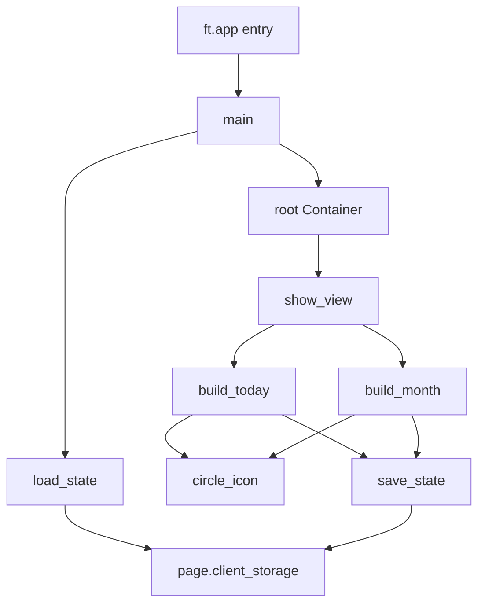

# C4 Code-Level Documentation: refocus_flet (root)

**Location:** [main.py](file:///c:/Users/jfmar/josemarichal/refocus_flet/main.py)
**Language:** Python 3
**Framework:** Flet 0.80.x

---

## Overview

Single-file Flet application implementing a 30-day goal adherence tracker. All UI, state, and navigation logic lives in `main.py`.

---

## Constants & Configuration

| Name | Value | Purpose |
|------|-------|---------|
| `DEFAULT_GOALS` | List[dict] | Seed list of 12 goals (name, italic, sep keys) |
| `DAYS` | 30 | Cycle length in days |
| `CYCLE` | [0, 1, 0.5] | Tap-cycle states: empty → done → partial |
| `PURPLE_*`, `WHITE`, `TEXT_DARK` | hex strings | Design token palette |
| `current_goal` | int (global) | Index of goal selected for Month view |

---

## Functions

### `load_state(page: ft.Page) → dict`
**Location:** main.py:34  
**Purpose:** Loads persisted JSON from `page.client_storage` ("refocus_state"). Migrates legacy state without `goals` key by injecting `DEFAULT_GOALS`. Pads `data` array if short. Falls back to a fresh state dict on any error.

**Returns:**
```python
{
  "month": "March 2026",
  "data":  [[int|float] * 30, ...],   # one row per goal
  "goals": [{"name": str, "italic": bool, "sep": bool}, ...],
  "rituals": {"ritual_1": str, ...}    # optional
}
```

**Dependencies:** `json`, `datetime`, `DEFAULT_GOALS`, `DAYS`

---

### `save_state(page: ft.Page, state: dict) → None`
**Location:** main.py:55  
**Purpose:** Serializes `state` to JSON and stores in `page.client_storage`. Swallows all exceptions (fire-and-forget).

**Dependencies:** `json`, `page.client_storage`

---

### `circle_icon(value: int|float, size: int = 26) → ft.Control`
**Location:** main.py:63  
**Purpose:** Factory returning a visual circle indicator for a goal's daily state:
- `1` → filled purple circle with check mark (`ft.Icons.CHECK`)
- `0.5` → half-filled circle (ft.Stack with left-half fill)
- `0` → empty circle with border

**Parameters:**
- `value`: one of `0`, `1`, `0.5`
- `size`: diameter in logical pixels

**Returns:** `ft.Container` or `ft.Stack`

**Dependencies:** `ft.Icons.CHECK`, `PURPLE_MID`, `PURPLE_BORDER`, `WHITE`, `ft.Alignment`, `ft.BorderRadius`

---

### `main(page: ft.Page) → None`
**Location:** main.py:94  
**Purpose:** Flet entry point. Sets up all page properties, state, and two nested view-builder functions, then initialises the root container and calls `show_view("today")`.

**Internal scope variables:**
- `state: dict` — live in-memory state shared by all closures
- `root: ft.Container` — single page-level container whose `.content` is swapped by `show_view`

---

#### `build_today(editing: bool = False) → ft.Column`
**Location:** main.py:105 (closure inside `main`)  
**Purpose:** Constructs the Today view as a `ft.Column`. When `editing=True`, shows delete buttons per goal and an add-goal field; otherwise shows ritual text field and daily tap rows.

**Key sub-closures:**
| Closure | Purpose |
|---------|---------|
| `on_ritual_change(e)` | Persists ritual text field changes |
| `make_delete(idx)` → handler | Removes goal at `idx` from state and re-renders |
| `make_cycle(idx, didx)` → handler | Advances tap state (0→1→0.5→0) for a goal/day cell |
| `make_nav(idx)` → handler | Sets `current_goal` and navigates to Month view |
| `add_goal(e)` | Appends new goal dict + empty data row to state |

**Dependencies:** `circle_icon`, `state`, `save_state`, `show_view`, `ft.Icons.*`, `ft.Alignment`, `DAYS`, `CYCLE`

---

#### `build_month(goal_idx: int) → ft.Column`
**Location:** main.py:295 (closure inside `main`)  
**Purpose:** Constructs the Month view for a specific goal. Shows adherence %, streak, completions, and a 7-column 30-day grid of tappable circles.

**Key sub-closures:**
| Closure | Purpose |
|---------|---------|
| `make_dot(d_idx)` → handler | Advances tap state for a specific past/present day |

**Dependencies:** `circle_icon`, `state`, `save_state`, `show_view`, `DAYS`, `CYCLE`

---

#### `show_view(name: str, editing: bool = False) → None`
**Location:** main.py:446 (closure inside `main`)  
**Purpose:** Flet 0.80.x-compatible navigation. Swaps `root.content` between `build_today()` and `build_month()` output, then calls `page.update()`. No routing API used.

**Dependencies:** `root`, `build_today`, `build_month`, `current_goal`, `page`

---

## Dependencies

### Internal
None (single-file app)

### External
| Package | Usage |
|---------|-------|
| `flet` (0.80.x) | Entire UI framework — controls, layout, events |
| `json` | State serialization |
| `datetime` | Current date for "today" index and month display |

---

## Relationships


