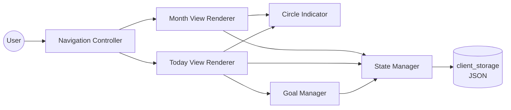

# C4 Component Documentation: Refocus App

**Type:** Desktop / Mobile Application (Flet/Flutter)
**Technology:** Python 3, Flet 0.80.x
**Code Elements:** [c4-code-root.md](c4-code-root.md)

---

## Overview

Refocus is a single-component application — there is no service split, no API layer, and no database. All logic is co-located in one executable Python module that runs as a native Flet desktop or Android app.

---

## Components

### 1. State Manager
**Files:** `load_state`, `save_state` in `main.py`  
**Purpose:** Loads and persists the entire app state as a JSON blob in Flet's `page.client_storage` (platform key-value store — SharedPreferences on Android, localStorage on web, JSON file on desktop).

**Interface:**
- Input: `page.client_storage.get("refocus_state")` → raw JSON
- Output: `page.client_storage.set("refocus_state", json)` → persists

**Responsibilities:**
- State schema migration (adds `goals` key if missing for legacy data)
- Data array synchronization (pads/trims rows to match goal count)

---

### 2. UI Renderer
**Files:** `circle_icon`, `build_today`, `build_month` in `main.py`  
**Purpose:** Constructs all Flet control trees. Purely functional — given state input, returns a `ft.Column` subtree. No direct mutation.

**Sub-components:**

| Sub-component | Builder Function | Description |
|---------------|-----------------|-------------|
| Circle Indicator | `circle_icon()` | Reusable visual: empty / half / full state |
| Today View | `build_today(editing)` | Daily check-in list + ritual field + edit mode |
| Month View | `build_month(goal_idx)` | 30-day grid + stats for one goal |

---

### 3. Navigation Controller
**Files:** `show_view`, `current_goal` global in `main.py`  
**Purpose:** Manages which view is currently displayed. Replaces deprecated Flet routing (`page.go` / `page.views`) with a single root `ft.Container` whose content is swapped.

**Navigation map:**
```
today (normal) ──[pencil]──► today (edit mode)
today (edit)   ──[done]────► today (normal)
today (normal) ──[goal row]► month (goal detail)
month          ──[←]───────► today (normal)
```

---

### 4. Goal Manager
**Files:** closures `make_delete`, `add_goal`, `make_cycle` in `main.py`  
**Purpose:** Handles dynamic goal CRUD operations and daily tap-cycle state changes.

**Operations:**
| Operation | Trigger | Effect |
|-----------|---------|--------|
| Add goal | "+" button in edit mode | Appends to `state["goals"]` + new data row |
| Remove goal | "−" button in edit mode | Pops from `state["goals"]` + data row |
| Cycle tap | Circle tap in today view | Rotates day value: `0 → 1 → 0.5 → 0` |
| Log past day | Circle tap in month view | Same cycle, historical day index |

---

## Component Diagram



---

## Interfaces

No external HTTP interfaces. The sole external interface is:

| Interface | Protocol | Direction | Description |
|-----------|----------|-----------|-------------|
| `client_storage` | Platform KV | Read/Write | Persists JSON state blob under key `"refocus_state"` |

---

## External Dependencies

| System | Type | Purpose |
|--------|------|---------|
| Flet runtime | Framework | UI host, event loop, platform integration |
| Android SharedPreferences | Platform KV | Backing store for `client_storage` on Android |
| Desktop filesystem | Platform KV | Backing store for `client_storage` on desktop |
