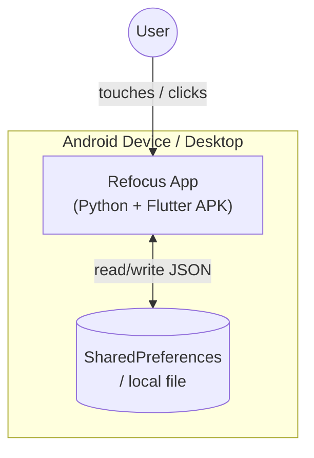

# C4 Container Documentation: Refocus App

**Component Reference:** [c4-component.md](c4-component.md)

---

## Containers

Refocus deploys as a **single container** — a native mobile/desktop application package. There is no server, no API, and no separate database container.

---

### Container: Refocus App Binary

| Attribute | Value |
|-----------|-------|
| **Name** | Refocus App |
| **Type** | Mobile Application (Android APK) / Desktop Executable |
| **Technology** | Python 3 + Flet 0.80.x → Flutter runtime |
| **Deployment** | `flet build apk` → signed APK sideloaded or distributed via GitHub Releases |
| **Entry point** | `ft.app(target=main)` in `main.py` |

**Purpose:** The entire application runs within this single binary. Flet compiles Python + Flutter into a self-contained APK. On desktop, it runs directly via the Flet desktop runner.

---

## Build Pipeline

```
main.py  ──[flet build apk]──►  refocus.apk
             │
             ├── pyproject.toml   (org, product, SDK versions)
             └── Flutter engine   (bundled by flet-cli)
```

**pyproject.toml settings:**
```toml
[tool.flet]
org     = "com.refocus"
product = "Refocus"

[tool.flet.android]
compileSdkVersion = 34
minSdkVersion     = 21
targetSdkVersion  = 34
```

---

## Storage

| Store | Technology | Key | Contents |
|-------|-----------|-----|----------|
| App state | Android SharedPreferences / desktop JSON | `"refocus_state"` | Goals, 30-day data matrix, ritual notes |

No network calls. No remote database. Fully offline.

---

## Container Diagram



---

## APIs

No external APIs. No OpenAPI spec required.

---

## Android Build Notes

To build the APK from this repo:

```bash
# 1. Install flet-cli (needs flet ≥ 0.21)
pip install flet

# 2. Build APK
flet build apk

# Output: build/apk/refocus.apk
```

**Known Issues (Flet 0.80.x):**
- `page.go()` / `page.on_route_change` deprecated — already fixed in this codebase
- `ft.alignment.*` constants removed — fixed: use `ft.Alignment(x, y)`
- `ft.icons.*` → must use `ft.Icons.*` (capitalized)
- `letter_spacing` on `ft.Text` → must use `style=ft.TextStyle(letter_spacing=...)`
