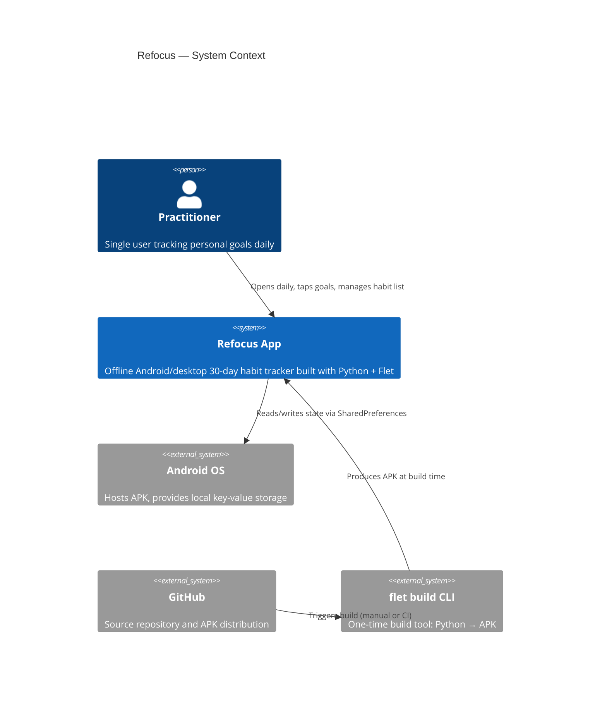

# C4 Context Documentation: Refocus System

**Container Reference:** [c4-container.md](c4-container.md)
**Component Reference:** [c4-component.md](c4-component.md)

---

## System Overview

**Short:** A private 30-day habit tracking app for Android and desktop.

**Long:** Refocus is a minimal, offline-first mobile application that helps a single user track adherence to a personal set of recurring goals over a 30-day cycle. Each day the user taps through three states (empty → done → partial) for each goal, optionally records a daily ritual intention, and reviews per-goal monthly progress with streak and adherence statistics. Goals are fully customisable — the user can add or remove them at any time. All data is stored locally on-device; there is no account, no sync, and no server.

---

## Personas

### Primary User — The Practitioner

| Attribute | Value |
|-----------|-------|
| **Type** | Human User |
| **Description** | A single individual (the app owner) tracking personal lifestyle goals |
| **Goals** | Check in daily, stay accountable, see streaks grow |
| **Key Features** | Daily check-in, ritual intention, month grid view, add/remove goals |

*(No other user types — this is a personal, single-user app.)*

---

## System Features

| Feature | Description | User |
|---------|-------------|------|
| Daily Check-In | Tap each goal to mark done / partial / empty for today | Practitioner |
| Ritual Intention | Write a daily intention text at the top of the day view | Practitioner |
| Monthly Grid | 30-day circle grid showing full month history for one goal | Practitioner |
| Stats Dashboard | Adherence %, streak count, completed days for each goal | Practitioner |
| Goal Management | Add new goals and delete existing ones via edit mode | Practitioner |
| Persistent State | All data saved locally between sessions (no login required) | Practitioner |

---

## User Journeys

### Daily Check-In Journey
1. Open Refocus app
2. See Today view with date and goal list
3. Write a ritual intention (optional)
4. Tap each circle to mark done (✓), partial (half), or leave empty
5. App auto-saves after every tap

### Monthly Review Journey
1. From Today view, tap the name/chevron of any goal
2. See Month view: adherence %, streak, completed count
3. Tap any past-day circle to retroactively edit it
4. Tap ← to return to Today

### Goal Management Journey
1. Tap the ✏️ (pencil) icon in the top-right header
2. App enters edit mode — each goal shows a 🗑 delete button
3. Tap 🗑 to remove a goal (removes its data too)
4. Type a new goal name in the bottom field, tap ➕ to add
5. Tap ✓ (done) to exit edit mode and return to normal view

---

## External Systems & Dependencies

| System | Type | Description |
|--------|------|-------------|
| Android OS | Platform | Hosts APK, provides SharedPreferences for `client_storage` |
| Flet / Flutter runtime | Framework | Bundled inside APK; no external call |
| `flet build` CLI | Build tool | Converts `main.py` → APK at development time |
| GitHub | Source / Distribution | Repo host; APK built via GitHub Actions or local `flet build apk` |

**No external APIs, no network calls, no authentication.**

---

## System Context Diagram

---

## Related Documentation

- [Code Level](c4-code-root.md) — all functions, signatures, internal relationships
- [Component Level](c4-component.md) — logical component breakdown
- [Container Level](c4-container.md) — deployment unit, build pipeline, storage
